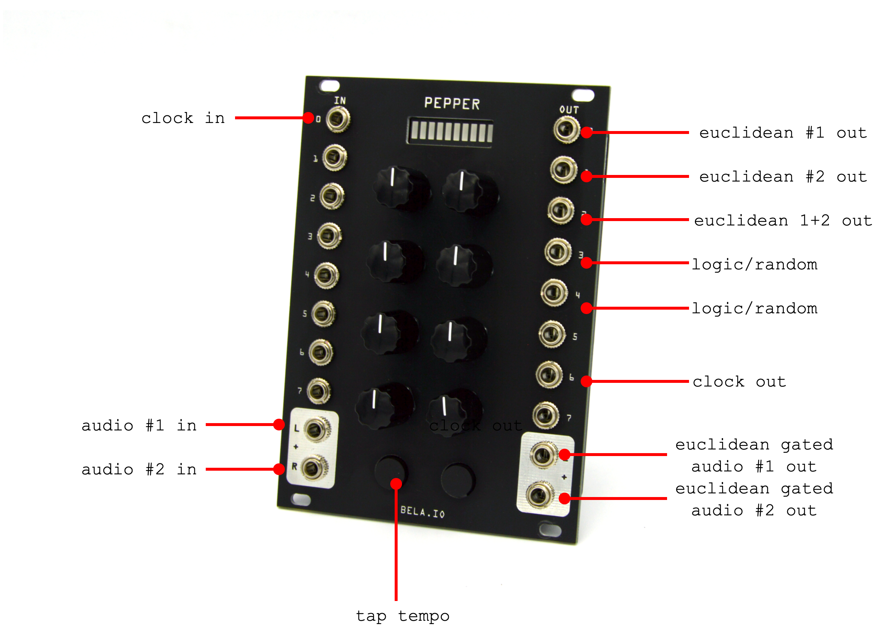

# Pimento
Euclidean Gate Sequencer for Bela Pepper Eurorack Module C++

[Bela Platform](https://bela.io/)

[Bela Pepper Guide](https://github.com/BelaPlatform/bela-pepper)

## Note
- If you are reading this then you are here too soon
- WIP - MVP coming soon
- The euclidean rhythm class is quite intelligible  

## Checklist
- [x] single euclidean gate output (<= 8 steps)
- [x] master clock
- [ ] scale log pots to linear ^.^
- [ ] rotate sequences
- [ ] Two Euclidean sequence output gates 
- [ ] An extra gate output that sequentially outputs each sequences
- [ ] Tap tempo
- [ ] Envelope two audio input channels according to the euclidean sequence and send to audio outs
- [ ] Clock Division
- [ ] Env & Seq Sample - choose with button
- [ ] Trigger fills with digital input gates
